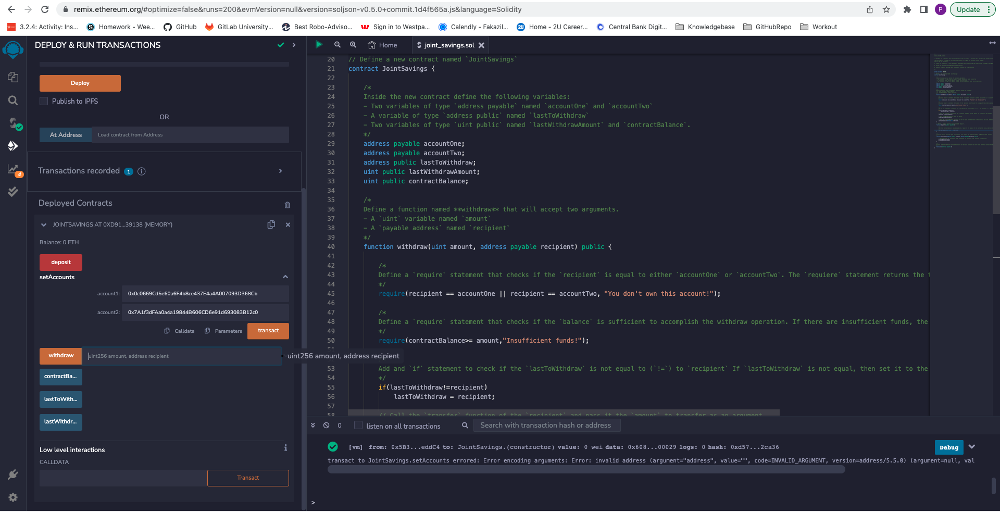
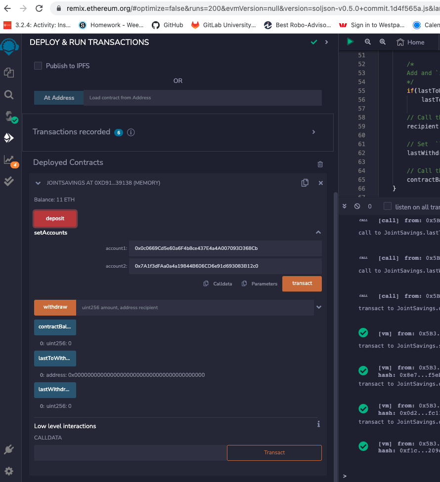
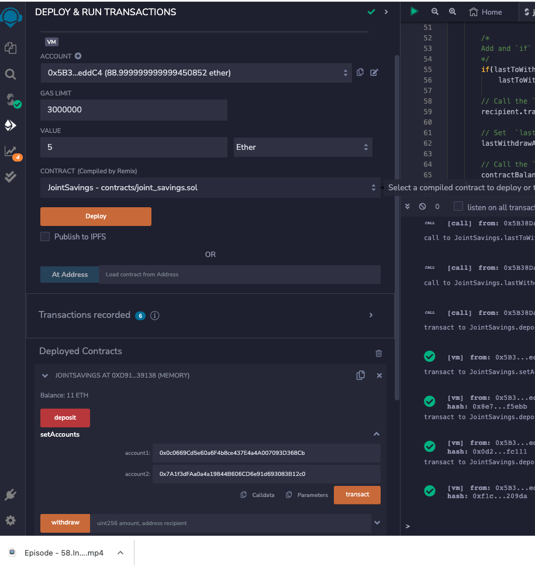
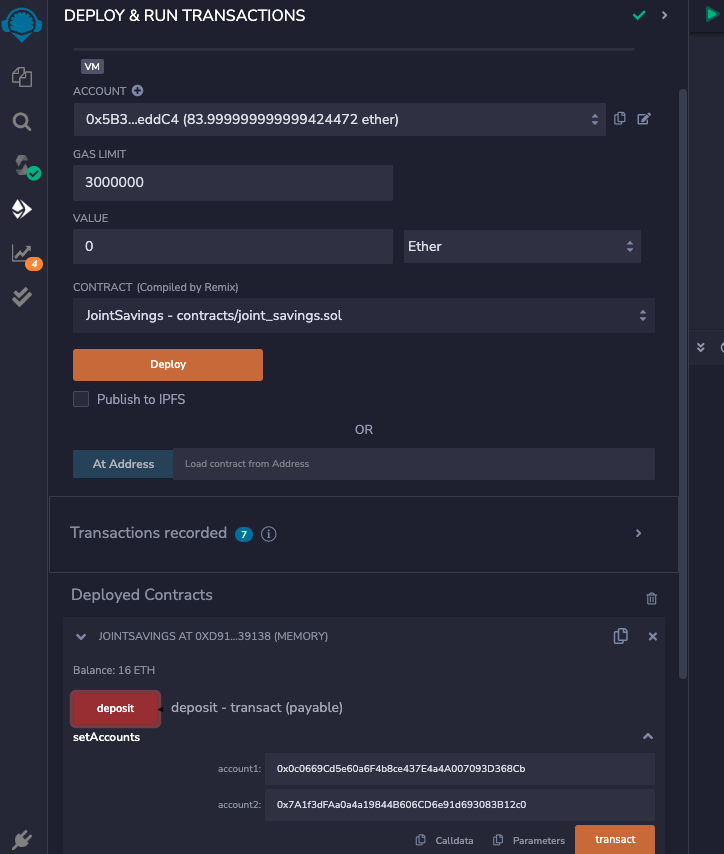
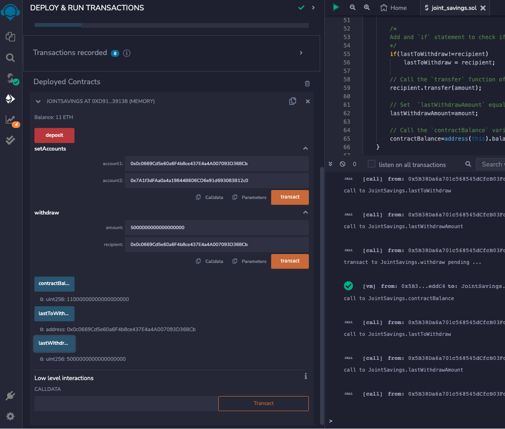
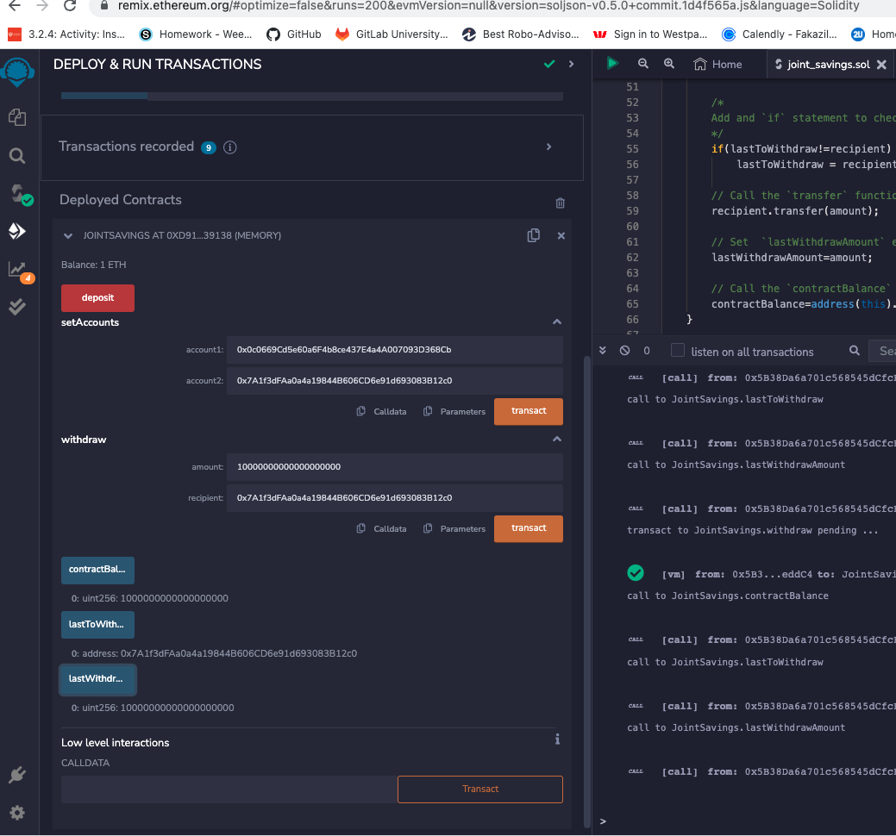

# JointSavingsAccount
In this module we automated the creation of joint savings accounts, we created a Solidity smart contract that accepts two user addresses. These addresses will be able to control a joint savings account. Our smart contract will use ether management functions to implement a financial institution’s requirements for providing the features of the joint savings account. These features will consist of the ability to deposit and withdraw funds from the account.

## Compile & Deploy Smart Contract

Please refer the video below for compiling and deploying JointSavings smart contract, the solution is in joint_savings.sol


## Functionality test

1. Using `setAccounts` function to define the authorized Ethereum address that will be able to withdraw funds from your contract.
    
    >
    > ```text
    > Dummy account1 address: 0x0c0669Cd5e60a6F4b8ce437E4a4A007093D368Cb
    > Dummy account2 address: 0x7A1f3dFAa0a4a19844B606CD6e91d693083B12c0
    > ```
    >

2. Testing Deposit functionality

    * Transaction 1: Send 1 ether as wei.

         

    * Transaction 2: Send 10 ether as wei.

         

    * Transaction 3: Send 5 ether.

         

         

    

3. Testing withdrawl functionality 

    * Withdraw 5 ether into `accountOne`, after  transaction, use the `contractBalance` function to verify that the funds were withdrawn from your contract. Also, use the `lastToWithdraw` and `lastWithdrawAmount` functions to verify that the address and amount were correct.

         
    
    * Withdraw 10 ether into `accountTwo`, after  transaction, use the `contractBalance` function to verify that the funds were withdrawn from your contract. Also, use the `lastToWithdraw` and `lastWithdrawAmount` functions to verify that the address and amount were correct.

        


